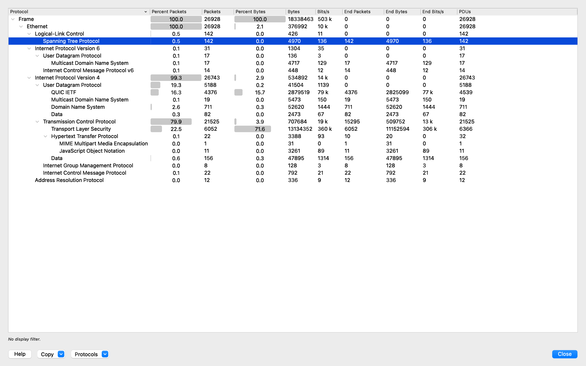

# Wireshark-Network-Analysis
Project Overview
This project demonstrates my ability to use Wireshark, a powerful network protocol analyzer, to capture and analyze network traffic. By examining real-time packet data, I identified potential security threats, performance issues, and anomalous behavior. This README includes detailed steps, analysis, and screenshots to showcase my skills in network monitoring, packet filtering, and threat detection—key competencies for a cybersecurity professional.

# Tools Used
- **Wireshark:** Network protocol analyzer for capturing and inspecting packets.

- **Operating System:** macOS 14

- **Network:** Local Wi-Fi for traffic capture.
  
#  Objectives
- Capture live network traffic from my local network.

- Apply filters to isolate specific protocols (e.g., HTTP, DNS).

- Analyze packet details to identify potential security risks (e.g., unencrypted traffic).

- Document findings with screenshots and explanations.

# Step-by-Step Process
# 1. Setup and Installation
  - Downloaded Wireshark from Wireshark's official site.

  - Installed Wireshark on my system following the official instructions

  - Verified administrative/root access to capture packets on my network interface.

# 2. Capturing Network Traffic
  - Launched Wireshark and selected my active network interface (e.g., Wi-Fi or Ethernet).

  - Started packet capture by clicking the "Start" button (shark fin icon).

  - Generated traffic by browsing websites (e.g., http://youtube.com) and performing DNS lookups (e.g., nslookup google.com).

  - Stopped the capture after collecting sufficient data (e.g., 5 minutes of activity).
    
Starting packet capture on my Wi-Fi interface.    

# 3. Filtering Traffic
Applied a filter to focus on HTTP traffic: http.
- This displayed all HTTP requests and responses in the capture.

Filtering HTTP traffic to analyze web requests and responses.

Filtered DNS traffic: dns.
- This isolated DNS queries and responses to analyze name resolution activity.

- DNS queries and responses to analyze name resolution activity.

Filtered by IP address: ip.addr == 192.XX.XX.XX
This narrowed down traffic to my specific machine.

# 4. Analyzing Packets
- Examined HTTP packets for unencrypted data:
Selected an HTTP packet and inspected the "Packet Details" pane.

- Noted cleartext data (e.g., GET requests), indicating a potential security risk.

- Investigated DNS traffic:
Identified frequent queries to unusual domains, which could suggest malware activity.

- Checked TCP traffic for anomalies:
Looked for excessive retransmissions or unexpected port activity

  Analyzing an HTTP packet revealing unencrypted data transmission.

# 5. Statistical Analysis
- Used Wireshark’s “Statistics” → “Protocol Hierarchy” to view protocol distribution.

- **Findings**:
  - TCP dominates (79.9% packets, 71.6% bytes), mostly TLS (22.5% packets, 11.5 MB)—secure web traffic.
  - QUIC (16.3% packets, 2.8 MB)—modern HTTP/3 traffic, likely streaming or Google services.
  - HTTP plaintext (0.1%, 22 packets)—confirms unencrypted traffic risk.
  - ICMP (0.1%, 22 packets)—matches `ping` diagnostics.

 Statistical breakdown of captured traffic by protocol

# 6. Saving and Documenting 
- Saved the packet capture as portfolio-capture.pcapng for future reference.

- Exported filtered HTTP traffic as a separate file (http-traffic.pcapng).

- Documented findings in this README with screenshots and explanations.

    
  ## Key Findings
- **Protocol Distribution**: TCP (79.9%) and UDP (19.3%) dominate, with TLS (11.5 MB) and QUIC (2.8 MB) as major contributors—indicating secure browsing and modern web apps 
- **Unencrypted HTTP Traffic**: Only 0.1% (22 packets), a security risk 
- **ICMP Traffic**: 0.1% (22 packets), normal for diagnostics

