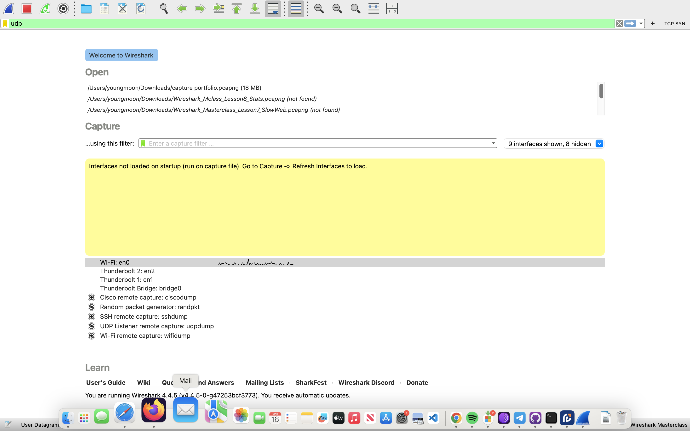
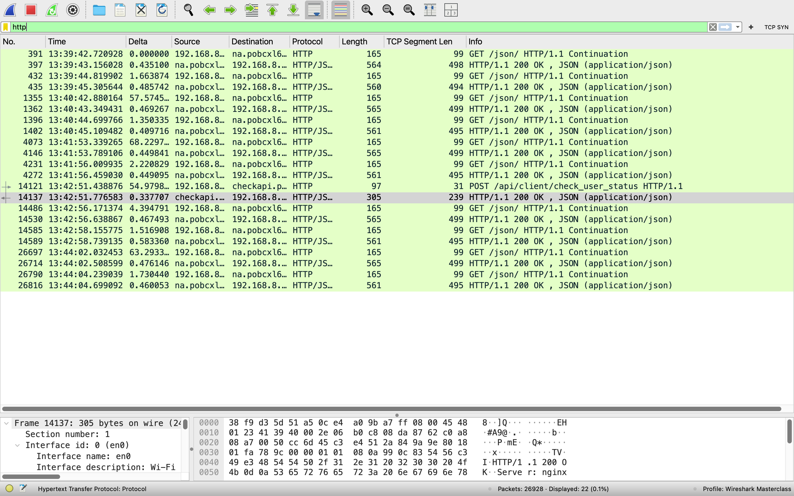
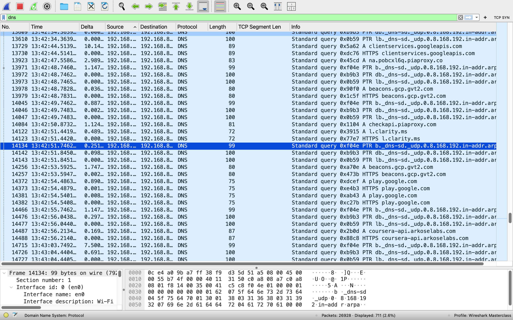
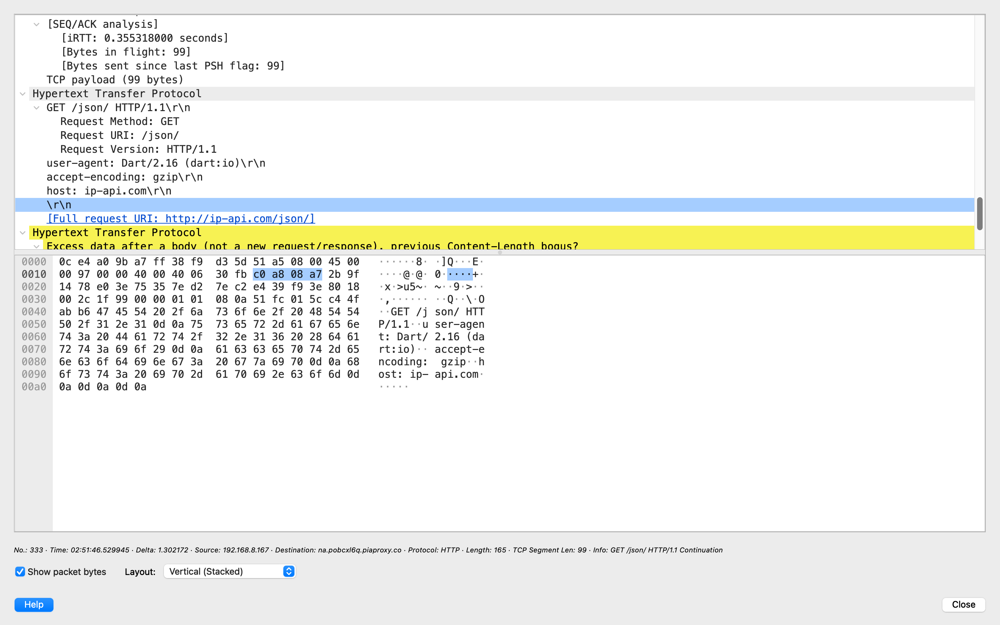
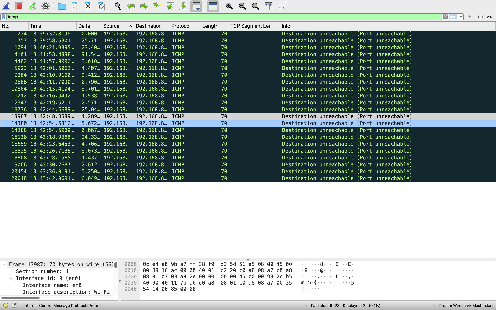

# Wireshark-Network-Analysis
Project Overview
This project demonstrates my ability to use Wireshark, a powerful network protocol analyzer, to capture and analyze network traffic. By examining real-time packet data, I identified potential security threats, performance issues, and anomalous behavior. This README includes detailed steps, analysis, and screenshots to showcase my skills in network monitoring, packet filtering, and threat detection—key competencies for a cybersecurity professional.

# Tools Used
- **Wireshark:** Network protocol analyzer for capturing and inspecting packets.

- **Operating System:** macOS 14

- **Network:** Local Wi-Fi or Ethernet connection for traffic capture.
  
#  Objectives
- Capture live network traffic from my local network.

- Apply filters to isolate specific protocols (e.g., HTTP, DNS).

- Analyze packet details to identify potential security risks (e.g., unencrypted traffic).

- Document findings with screenshots and explanations.

# Step-by-Step Process
# 1. Setup and Installation
  - Downloaded Wireshark from Wireshark's official site.

  - Installed Wireshark on my system following the official instructions for [your OS].

  - Verified administrative/root access to capture packets on my network interface.

# 2. Capturing Network Traffic
  - Launched Wireshark and selected my active network interface (e.g., Wi-Fi or Ethernet).

  - Started packet capture by clicking the "Start" button (shark fin icon).

  - Generated traffic by browsing websites (e.g., http://youtube.com) and performing DNS lookups (e.g., nslookup google.com).

  - Stopped the capture after collecting sufficient data (e.g., 5 minutes of activity).
    

# 3. Filtering Traffic
Applied a filter to focus on HTTP traffic: http.
- This displayed all HTTP requests and responses in the capture.

- Filtering HTTP traffic to analyze web requests and responses.

Filtered DNS traffic: dns.
- This isolated DNS queries and responses to analyze name resolution activity.

- DNS queries and responses to analyze name resolution activity.

Filtered by IP address: ip.addr == 192.168.1.10 (replace with your device's IP).
This narrowed down traffic to my specific machine.

Below are key visuals from my Wireshark traffic analysis:

1. 
2. 
3. 
4. 
5. 

